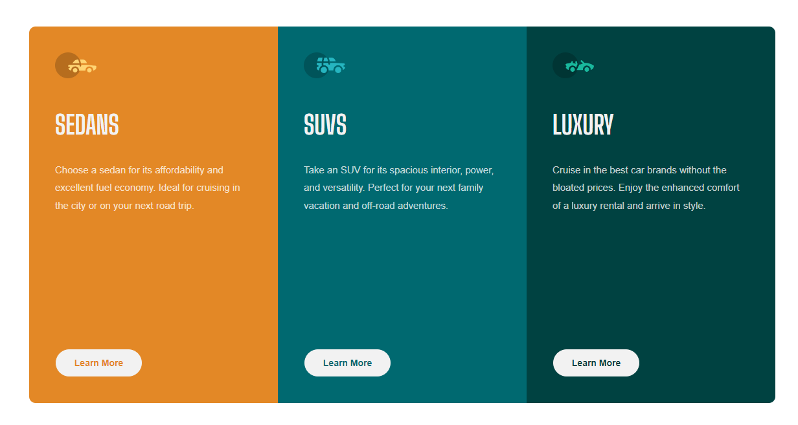

# Frontend Mentor - 3-column preview card component solution

This is a solution to the [3-column preview card component challenge on Frontend Mentor](https://www.frontendmentor.io/challenges/3column-preview-card-component-pH92eAR2-). Frontend Mentor challenges help you improve your coding skills by building realistic projects. 

## Table of contents

- [Frontend Mentor - 3-column preview card component solution](#frontend-mentor---3-column-preview-card-component-solution)
  - [Table of contents](#table-of-contents)
  - [Overview](#overview)
    - [The challenge](#the-challenge)
    - [Screenshot](#screenshot)
    - [Links](#links)
  - [My process](#my-process)
    - [Built with](#built-with)
    - [What I learned](#what-i-learned)
    - [Continued development](#continued-development)
  - [Author](#author)

## Overview

### The challenge

Users should be able to:

- View the optimal layout depending on their device's screen size
- See hover states for interactive elements

### Screenshot



### Links

- Solution URL: [Frontend Mentor](https://www.frontendmentor.io/challenges/3column-preview-card-component-pH92eAR2-/hub/3-column-preview-card-component-css-flexbox-L1cKFwDzsj)
- Live Site URL: [Vercel](https://3-column-preview-card-component-omega-seven.vercel.app)

## My process

### Built with

- Semantic HTML5 markup
- CSS utility classes
- Flexbox
- CSS Grid

### What I learned

I learned how to fix the problem of the `<button>` element being uneven with the other `<button>` elements since the `<p>` element changes height in response to the user's device width. My solution was to set a fixed `height` to the `<p>` elements. I'm not sure if this is the right way to go about this but let me know if you have a better solution.

```html
<main class="flex-center">
    <div class="container">
        <div class="sedans card">
            
            <h1>Sedans</h1>
            <p>Choose a sedan for its affordability and excellent fuel economy. Ideal for cruising in the city 
                or on your next road trip.</p>
            <button type="submit">Learn More</button>
        </div>
        <div class="suvs card">
            
            <h1>Suvs</h1>
            <p>Take an SUV for its spacious interior, power, and versatility. Perfect for your next family vacation 
                and off-road adventures.</p>
            <button type="submit">Learn More</button>
        </div>
        <div class="luxury card">
            
            <h1>Luxury</h1>
            <p>Cruise in the best car brands without the bloated prices. Enjoy the enhanced comfort of a luxury 
                rental and arrive in style.</p>
            <button type="submit">Learn More</button>
        </div>
    </div>
</main>
```
```css
.card p {
    font-family: var(--primary-font);
    font-size: 15px;
    color: hsla(0, 0%, 100%, 0.75);
    margin-top: 2rem;
    line-height: 1.7rem;
    height: 150px;
}
```

### Continued development

I want to learn how to design my @media queries better since I feel I could be doing something better but don't know what. There are a lot of copy + pasting and repetitive actions I perform, such as adjusting the height and width of elements for every `@media` query. From my experience, if you do the same thing multiple times, there is a better and faster way to do it. I'm wondering if that's the case here. Let me know your thoughts. Other than that, the HTML and CSS layout went pretty smooth as there were no complicated multi-layout designs. The problem came mainly from the uneven <button> alignment.

## Author

- Website - [Justin Vera](https://www.justinvera.com)
- Frontend Mentor - [@justinnvera](https://www.frontendmentor.io/profile/justinnvera)
